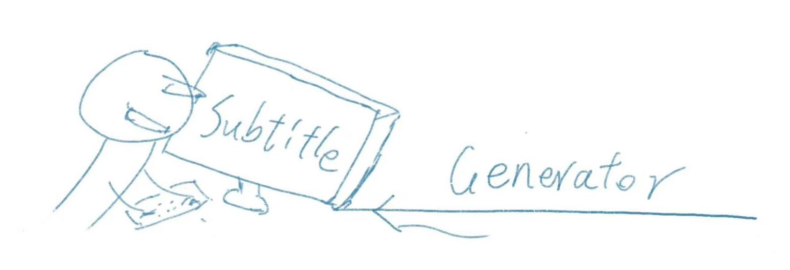

# Subtitle-Generator 

this is a bilingual Subtitle Generator for video

## Installation

Clone the project to localv

use python to build a development environment
'<python3 -m venv xxx_env>'

Then activate the development environment

Install all the requrment library
'<pip install -r requirements.txt>'

If your network connection is unstable, consider using a proxy
'<pip install -r requirements.txt --proxy=http://[address]:[port]>'

## Usage

There are two ways to start this program

First, you can use the terminal(cmd) to run the main.py file, and then translate it according to the instructions
Note: first you need to activate the development environment in the terminal

Second, you can drag the video file into the main.py file in the scr directory
Note: You need to specify the python program in the development environment in the first line of main.py file

After that, the program will generate a subtitle file with the same name in the root directory of the video file, which can be played by VLC player

